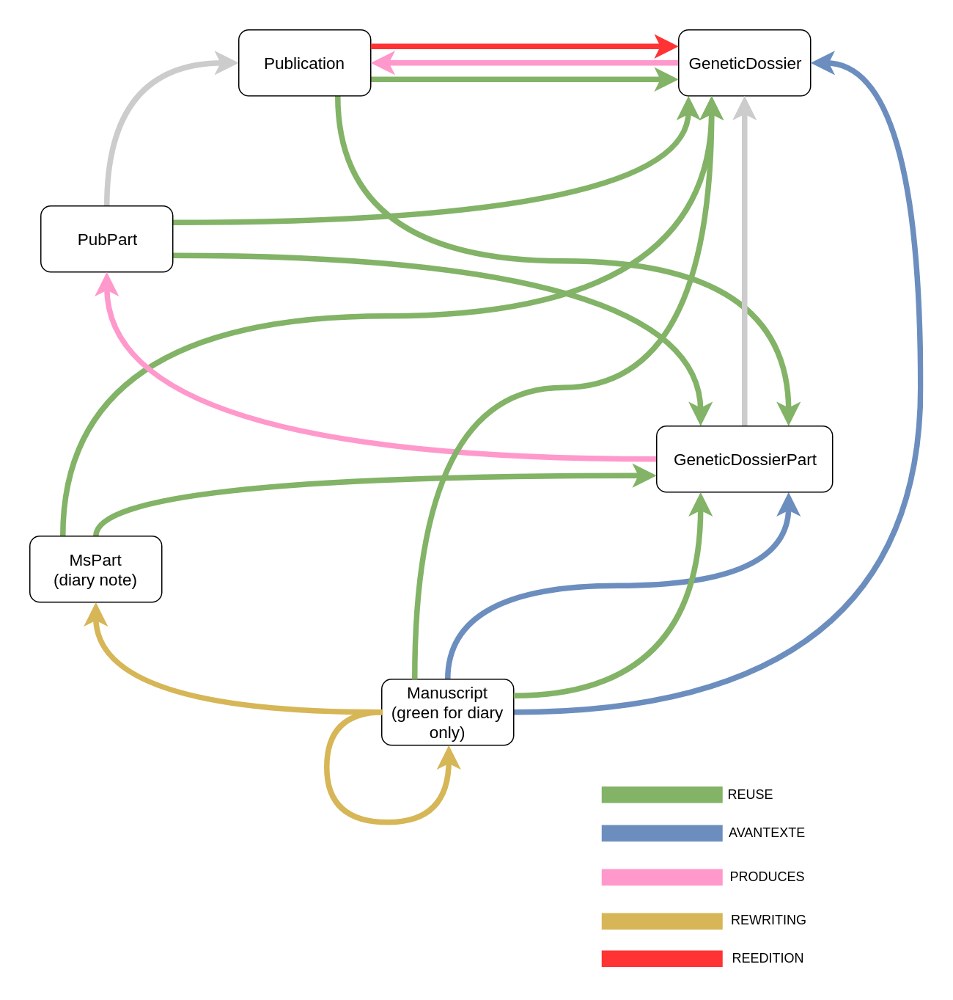

# Mode d’emploi de Knora-Salsah

## Table des matières

- [Premiers pas et configurations générales](#premiers-pas-et-configurations-générales)
- [Recherche simple](#-recherche-simple)
- [Label (étiquette)](#-label-étiquette)
- [Symboles logiques utilisés dans les requêtes](#-symboles-logiques-utilisés-dans-les-requêtes)
- [Recherche avancée](#-recherche-avancée)
- [Lire, modifier et effacer une ressource et ses liens](#-lire-modifier-et-effacer-une-ressource-et-ses-liens)
- [Spécifier plusieurs conditions sur des propriétés](#-spécifier-plusieurs-conditions-sur-des-propriétés)
- [Classe abstraite Publication](#-classe-abstraite-publication)
- [Dates dans les manuscrits](#-dates-dans-les-manuscrits)
- [Liens et références bibliographiques dans le texte](#-liens)
- [Distinction entre auteur et personne](#-distinction-entre-auteur-et-personne)
- [Saisie des données](#-saisie-des-données)
- [Problèmes](#-problèmes)
- [Raccourcis clavier](#-raccourcis-clavier)

<a href="#top">&#11025;</a>Premiers pas et configurations générales
===================================================

S’identifier, en cliquant sur le bonhomme bleu.

Choisir la langue, en haut à droite.

Toutes les fenêtres peuvent être déplacées et redimensionnées.

Icônes :

**loupe**, lance la recherche simple avec le(s) mot(s) inséré(s) dans le
champ texte à côté (*toujours limiter la recherche à une base*) ;

**loupe avec plus**, ouvre la fenêtre pour la recherche avancée ;

**plus**, ouvre la fenêtre pour insérer des données.

<a href="#top">&#11025;</a> Recherche simple
=============================

En haut de la page. Sélectionner la base sur laquelle lancer la
recherche : *roud-oeuvres* ; insérer le(s) mot(s) à chercher et envoyer la requête.
Pour chercher plusieurs mots suivis, utiliser " au début et à la fin, ex. "bain d'un faucheur".

Les résultats s’ouvrent dans une nouvelle fenêtre. La première chose à
regarder est le type de ressource (deuxième colonne) ; en passant la
souris sur la ‘*i*’ (première colonne), on obtient un aperçu de la
ressource.

**Exemple : recherche simple du mot Chappaz (ou chappaz, les
majuscules ne comptent pas)**. On a 15 résultats, parmi lesquels des
documents d’archives, des livres, des sections de livre, des articles et
la personne Maurice Chappaz.

<a href="#top">&#11025;</a> Label (étiquette)
==============================

Les labels sont très importants dans Knora-Salsah parce qu’ils
permettent d’identifier et de faire référence à une ressource. Quand on
lance une recherche simple, la troisième colonne des résultats est le
label (voir exemple ci-dessus).

Les labels ont la forme listée ci-dessous, selon le cas :

- en italique les variables à remplacer cas par cas, suivi par \_ sans
espace ;
- pour l’auteur sont toujours donnés : *Nom Prénom*.

En ordre alphabétique :

### Auteur, traducteur, éditeur, collaborateur

aut\_*Auteur*

ex : aut\_Roud Gustave

ex : aut\_Crisinel Edmond-Henri

### Document d'archive

fiche\_*Fonds Cote*\_*Titre*

ex : fiche\_CRLR GR MS 1 I/8c\_Canzone di Togliatti

ex : fiche\_CRLR GR MS 6 B1 /1a\_\[…wohl versteh ich die Frage…\]

ex : fiche\_Bibliothèque Roud\_Note de lecture Cesare Pavese: "La Luna e i falò"

### Dossier génétique

dossier\_*titre*\_*si pas livre, titre du volume ou du périodique*\_*date ou seulement année*

ex : dossier\_Adieu\_1927

ex : dossier\_L'Aveuglement\_Écriture\_1966

### Dossier génétique (partie)

dossierPartie\_*label du dossier*\_*numéro progressif de la partie de la publication ou du manuscrit corréspondant*

ex : dossierPartie\_Adieu\_1927\_1

ex : dossierPartie\_L'Aveuglement\_Écriture\_1966\_2

<!--
### Événements biografique

bio\_année (si periode, premierAnnée-DeuxiemeAnnée)
-->

### Lieu

lieu\_*nom du lieu*

ex : lieu\_Clos des Abbayes

### Maison d’édition

edi\_*Nom de la maison d’édition*

ex : edi\_L'Âge d'Homme

### Œuvre (littéraire, musique, art)

œuvre\_*auteur*\_*titre*

ex : œuvre\_Clément Charles\_Pont sur l'Aubonne

### Page scanée

page\_*fonds*\_*cote*\_*nom de la page*\_*numéro progressif*

page\_*titre*\_*si pas livre, titre du volume ou
du périodique*\_*date*\_*nom de la page*\_*numéro progressif*

### Parcours

parcours\_*titre abrégé*

ex : parcours\_Mise en recueil

### Partie d'un manuscrit (journal seulement)

msPartie\_*titre de la partie*\_*fonds et cote*\_*numéro progressif*

ex : msPartie\_27. II. 17.\_CRLR GR MS 4A/1a\_15

### Partie d'une publication

pubPartie\_*titre de la partie*\_*titre de la publication*\_*si pas livre, titre du volume ou
du périodique*\_*date ou année seulement*\_*numéro progressif*

ex : pubPartie\_II\_L'aveuglement\_Écriture\_1966\_2

ex : pubPartie\_[Cube de corps et de fumée]\_Adieu\_1927\_2

### Périodique

period\_*Nom du périodique*

ex : period\_Formes et couleurs

### Personne

pers\_*Personne*

ex : pers\_Colomb Catherine

ex : pers\_Thévoz Edmond

ex : pers\_Rey-Milliet Constant

### Photo

photo\_*legende de la photo (abrégé si longue)*

ex : photo\_Louisa Cherpillod

### Publication (article dans périodique)

pub\_*Auteur*\_*Titre de l’article*\_*Nom du périodique*\_*date*

Il n’est pas nécessaire de mettre des underscores à l’interieur du nom
du périodique.

ex : pub\_Roud Gustave\_Annonce d'un Adieu\_Présence\_1932

ex : pub\_Roud Gustave\_Un livre sur Gaston Vaudou\_Gazette\_de\_Lausanne\_1958-09-27

### Publication (livre)

pub\_*Auteur*\_*Titre*\_*Date*

ex : pub\_Collectif\_Gustave Roud, la plume et le regard\_1991

ex : pub\_Roud Gustave\_Le Repos du cavalier\_1952

### Publication (section d’un livre)

pub\_*Auteur*\_*Titre de la section*\_*Titre du volume*\_*date*

ex : pub\_Roud Gustave\_\[Peut-être la brève présentation…\]\_Catherine Colomb, Œuvres\_1968

ex : pub\_Pache Roger\_Mes relations d'amitié avec Gustave Roud,\_Rencontres et Souvenirs, 1914-1984\_1985

### Texte établi

Si imprimé → texte\_*titre*\_*si pas livre, titre du volume ou
du périodique*\_*date*

Si manuscrit → texte\_*titre\_fonds cote*

ex : texte\_Adieu\_1927

ex : texte\_Cueilleurs de pommes à Monnéaz\_La\_Guilde\_du\_Livre\_1946

ex : texte\_Cueilleurs de pommes à Monnéaz\_CRLR GR MS 1 G/2b

ex : texte\_Catherine Colomb ou notre monde périssable sauvé par la
poésie\_CRLR GR MS 2 F/4b

<a href="#top">&#11025;</a> Symboles logiques utilisés dans les requêtes
============================================

### Pour les textes

= est égal, identique

≠ est différent, inégal

∈ inclut (un ou plusieurs signes)

⊂ inclut (tous les signes)

⊄ n’inclut pas

∃ existe, est différent de vide ou de zéro

### Pour les dates

= pour une date ou une période

&gt; après une date

≥ après ou égal à une date

&lt; avant une date

≤ avant ou égal à une date

### Exemples
Pour les exemples suivants, ouvrir la recherche avancée (loupe avec
plus, en haut)

**Exemple 1 : tous les livres qui ont des collaborateurs (éditeurs,
traducteurs, etc., en plus de l’auteur).**

Sélectionner le vocabulaire : Œuvres complètes de Gustave Roud ;

le type de ressource : Livre ;

le champ de propriété : Collaborateurs ;

choisir ∃, on obtient 43 résultats.

**Exemple 2 : tous les livres qui ont des collaborateurs parmi lesquels
figure Chappaz.**

Sélectionner le vocabulaire : Œuvres complètes de Gustave Roud ;

le type de ressource : Livre ;

le champ de propriété : Collaborateurs ;

choisir **⊂** et écrire chappaz ou Chappaz (les majuscules ne comptent
pas), on obtient 1 résultat.

**Exemple 3 : tous les livres qui ont des collaborateurs parmi lesquels ne
figure pas Chappaz.**

Sélectionner le vocabulaire : Œuvres complètes de Gustave Roud ;

le type de ressource : Livre ;

le champ de propriété : Collaborateurs ;

choisir **⊄** et écrire chappaz ou Chappaz, on obtient 42 résultats.

**Noter** que en choisissant le symbole ‘**=**’ Chappaz, on n’a aucun
résultat parce que la valeur de la propriété Collaborateurs n’est jamais
seulement ‘Chappaz’ ; en choisissant **≠** Chappaz, on obtient donc 43
résultats.

<a href="#top">&#11025;</a> Recherche avancée
=================

Ouvrir la fenêtre pour la recherche avancée avec l’icône loupe et plus.

Sélectionner le vocabulaire à utiliser : ‘Œuvres complètes de Gustave
Roud \[roud-oeuvres\]’.

Choisir le type de ressource (livre, personne, document d’archive, etc.)
et, pour chaque type de ressource, ses propriétés (pour un livre :
l’auteur, le titre, la date de publication, etc. ; pour une personne :
le prénom, le nom, la date de naissance, etc.).

Filtre et modes d’affichage : régler selon besoins.

Tous les champs sont optionnels.

Dans l’affichage des résultats, après le colonnes *info*, *type* et
*label*, il y aura une colonne pour chaque propriété spécifiée dans la
requête (si des propriétés ont été spécifiées).

**Exemple 1 : toutes les personnes.**

Après avoir sélectionné le vocabulaire, choisir le type de ressource :
Personne. Lancer la recherche, on obtiendra 91 résultats.

**Exemple 2 : tous les article publiés dans une revue.**

Après avoir sélectionné le vocabulaire, choisir le type de ressource :
Article de périodique.

Dans le champ de propriété, choisir Périodique ; comme symbole, choisir
‘**=**’ ; ici on ne peut pas écrire librement, mais sélectionner à
partir d’une liste de périodiques identifiés par leurs *labels* (d’où
l’importance du label). Le *label* d’un périodique commence toujours par
‘period\_’ donc il suffira d’écrire ça et la liste se déroule.
Malheureusement, la liste n’est pas ordonnée, il faudra donc continuer à
écrire pour voir moins d’options, par exemple ‘period\_La semaine de la
femme’.

Lancer la recherche, on obtiendra 11 résultats.

**Exemple 3 : un document par sa cote.**

Après avoir sélectionné le vocabulaire, choisir le type de ressource :
Document d’archive. Dans le champ de propriété, choisir Cote du
document ; comme symbole, choisir ‘**=**’ ; écrire la cote d’un
document, par exemple ‘MS 2 C/8a’ (attention aux espaces!!!). Lancer la
recherche, on obtiendra 1 résultat.

La quatrième colonne des résultats donnera la cote, car on a spécifié
cette propriété dans la requête.

**Exemple 4 : les documents dont la cote commencent par ‘MS 2 C’.**

Après avoir sélectionné le vocabulaire, choisir le type de ressource :
Document d’archive. Dans le champ de propriété, choisir Cote du
document ; comme symbole, choisir ‘⊂’ ; écrire le début de la cote
souhaitée ‘MS 2 C’ (attention aux espaces!!!). Lancer la recherche, on
obtiendra 27 résultats.

La quatrième colonne des résultats donnera la cote, car on a spécifié
cette propriété dans la requête.

<a href="#top">&#11025;</a> Lire, modifier et effacer une ressource et ses liens
====================================================

Lire
----

Une fois qu’une requête a été effectuée, cliquer dans la liste des
résultats sur la ressource à afficher : une nouvelle fenêtre s’ouvre. Le
petit graphe en haut donne une visualisation des liens entre les
données. La première ligne contient un point d’interrogation pour
[créer des liens](#liens) ; le type (ou classe) de la ressource ; une
poubelle pour effacer la ressource entière. Les autres icônes ne seront
pas utilisées. La deuxième ligne montre le label.

La section Descriptive Metadata contient les données de cette ressource.

En plus, le champ ‘a standoff lien vers’ liste les liens à des
ressources qui existent dans des champs textes de la ressource présente
(par exemple, dans la ressource ‘pers\_Chappaz Maurice’ il y apparaît la
publication de la correspondance, car dans la notice – qui est un champ
texte– il y a un lien à ça). Tous en bas de la fenêtre, dans la section
‘Other objects referencing this object’ sont listées toutes les
ressources qui ont des liens vers la ressource présente (**par exemple,
pour une publication apparaissent ici les documents d’archive en
liens**).

Modifier
--------

La modification des valeurs des propriétés d’une ressource qui existent
déjà se fait directement dans la/les valeur(s) à modifier, et non pas
pour la ressource entière.

Cliquer sur le petit crayon à côté de la valeur à modifier, modifier, ne
pas oublier de sauvegarder (cliquer sur l’icône floppy disk) avant de
fermer la fenêtre.

Attention! Mettre à jour le label, si les valeurs changées sont les
mêmes qui figurent dans le label (par exemple la date).

Effacer
-------

Pour effacer une ressource entière, utiliser l’icône de la poubelle
grise en haut de la fenêtre de la ressource.

Pour effacer le valeur d’une propriété, utiliser l’icône de la poubelle
rouge et blanche à côté de la valeur même.

Dans les deux cas, un message de confirmation s’affiche avant de
procéder à éliminer la ressource.

<a href="#top">&#11025;</a> Spécifier plusieurs conditions sur des propriétés
=================================================

On peut ajouter des conditions sur plusieurs propriétés (icône plus sous
‘Champ de propriété’) ; quand plusieurs conditions sont spécifiées, les
résultats doivent satisfaire aux deux conditions (AND), et non pas l’une
ou l’autre (OR).

**Exemple 1 : les documents du fonds Gustave Roud du CRLR dont la cote
commence par MS 2 C et qui font partie de l’œuvre poétique.**

Type de ressource : Document d’archive ;

champ de propriété : Cote du document ⊂ ‘MS 2 C’ ;

champ de propriété : Fonds **=** ‘CRLR GR’ ;

lancer la recherche, on obtiendra 27 résultats.

Changer le deuxième champ de propriété (fonds) et choisir : Ensemble
éditorial **=** ‘Œuvre poétique’ ;

lancer la recherche, on obtiendra 8 résultats.

Modifier le champ de propriété : Ensemble éditorial **=** ‘Propos’ ;

lancer la recherche, on obtiendra 19 résultats.

<a href="#top">&#11025;</a> Classe abstraite Publication
============================

Certaines classes (ou types de ressource) et propriétés sont des classes
et propriétés abstraites (ou "mère"), c’est à dire qu’elles ont des
sous-classes et sous-propriétés concrètes qui sont utilisées dans la
base. Par exemple, les classes ‘Livre’, ‘Section d’un livre’ et ‘Article
de périodique’ sont des sous-classes de la classe ‘Publication’.

Les classes et propriétés abstraites sont marquées comme ‘Classe
abstraite, seulement pour les requêtes’ pour ne pas créer de confusion
lorsqu’on insère des données. Par contre, elle peuvent être utiles lors
d’une requête (même si les propriétés sont limitées aux propriétés en
commun des sous-classes).

**Exemple 1 : les publications de Roud antérieures à une certaine date.**

Type de ressource : Publication (abstraite) ;

champ de propriété : Auteur **=** ‘aut\_Roud Gustave’ ;

champ de propriété : Date **&lt;** ‘1920’ ;

lancer la recherche, on obtiendra 3 résultats.

<a href="#top">&#11025;</a> Dates dans les manuscrits
=========================

Les manuscrits peuvent avoir une date ou une datation. Chaque date et
datation a une version ‘lisible’ et une version ‘formalisée’, qui permet
à la machine de faire des calculs.

Les dates et datations lisibles sont ce qu’on voudrait voir dans le
site, pendant que les dates et datations formalisées servent à la
machine. Les recherches doivent se faire sur les dates et les
datations formalisées.

Pour faire des recherches sur des dates et des datations en même temps
(par exemple, tous les manuscrits avant 1920, qui ont une date ou une
datation avant 1920), on a deux possibilités :

- faire **deux recherches séparées (et non pas ajouter plusieurs
conditions sur les propriétés)**

- faire **une seule recherche en utilisant une propriété abstraite qui
regroupe les deux**. Pour ce faire, ouvrir une fenêtre pour la recherche
avancée, ne pas sélectionner de type (ou classe) et sélectionner la
propriété, vers la fin de la liste : **‘(Propriété abstraite, seulement
pour les requêtes) Date ou datation formalisées du document’**. Spécifier
les valeurs requises et lancer la recherche.

**Exemple : en utilisant la propriété abstraite ‘(Propriété abstraite,
seulement pour les requêtes) Date ou datation formalisées du document’**,
on voit que tous les manuscrits qui ont une date ou datation avant
(&lt;) 1920 sont au nombre de 35. Tous les manuscrits qui ont une date
ou une datation avant ou égal à (≤) 1920 sont au nombre de 48.

<a href="#top">&#11025;</a> Liens et références bibliographiques
==================================================

Les ressources peuvent avoir des propriétés de type texte, comme les
notices ou les commentaires. Ici, on peut insérer des liens vers
d’autres ressources : des personnes, des entrées bibliographiques, des
lieux, des œuvres, etc.

Pour ce faire (si la ressource existe déjà cliquer sur le petit crayon pour [modifier](#lire) la
valeur dans laquelle on veut insérer un lien), **sélectionner la portion de
texte qui portera le lien, ouvrir dans une autre fenêtre la ressource
vers laquelle le lien se dirige, drag and drop le point d’interrogation**
(en haut de la fenêtre de la ressource target) sur la portion de texte
sélectionné. 

Pour toute **référence bibliographique**, le lien se tient sur une portion
de texte composée de la façon suivante : auteur, titre, année. S’il
s’agit d’un article en revue ou d’un chapitre d’un ouvrage, le titre de
l’article ou du chapitre sera suivi par le nom du livre ou du periodique. Les titres des livres vont en italique. Le lien permettra d’afficher la
ressource complète en passant la souris dessus ou en cliquant.

**Exemple :  Roud, « Hölderlin », *Formes et couleurs*, 1945.**

**Exemple :  Trakl, *Vingt-quatre poèmes*, 1990.**

S'il s'agit d'une référence directe, l'ajouter entre parenthèses ou dans le texte. Quand il s'agit d'une référence secondaire, on peut utiliser *voir*.

Pour des exemples, voir dans les commentaires des documents d’archives,
où les liens ont été créés à partir des \[Biblio *num*\] dans les fiches
(avec le symbole ∃ on pourra rechercher tous les documents d’archives
qui ont des commentaires).

Dans le cas d'un lien vers une fiche, le lien se tient sur une portion de texte composée de la façon suivante : fonds cote.

**Exemple : CRLR GR MS 1 A/1a**.

<a href="#top">&#11025;</a> 
Distinction entre auteur et personne
==================================

La personne a une notice, éventuellement une photo, et peut être
mentionnée dans un texte de Roud.

L’auteur (traducteur, éditeur ou collaborateur) est une personne qui
apparaît dans une entrée bibliographique, mais pour laquelle il n’y a ni
notice ni photo.

Par exemple, Olivier Cherpillod est une personne, tandis que Ursula
Kobilijac est une autrice. Certains peuvent figurer comme personne et
comme auteur (traducteur, éditeur ou collaborateur), c’est le cas de
Catherine Colomb ou Maurice Chappaz.

<a href="#top">&#11025;</a> Saisie des données
========

Pour insérer des données, cliquer sur l'icône verte +, en haut à droite.
Dans la fenêtre qui s'ouvre, choisir la classe.

Des indications sur la saisie pour chaque classe (en ordre alphabétique) sont présentés ici à suivre.

<a href="#top">&#11025;</a> Saisie des auteurs, traducteurs, etc.
-----------------

Attention! Ne pas indiquer VIAF ID et ID du Dictionnaire historique de la Suisse. Ces propriétés ont vocation à disparaître.

<a href="#top">&#11025;</a> Saisie des lieux
-----------------

La latitude et longitude d'un lieu peuvent être trouvées de différentes manières. Utiliser par exemple :

- https://www.openstreetmap.org. Chercher le nom du lieu : lat et long, dans l'ordre, apparaissent à gauche, sous *Location*. Pour les lieux qui ne sont pas signalés, choisir le dernier bouton à droite (query features) et cliquer sur le point souhaité : des *Nearby features* et *Enclosing features* apparaissent. S'il y en a dont la localisation corresponde à celle souhaitée, utiliser la latitude et longitude.
- https://www.latlong.net/
- https://www.google.com/maps. Lat et long apparaissent avec un clic droit sur l'icône rouge sur la carte (il suffit de cliquer dessus pour copier-coller). Pour les lieux qui ne sont pas signalés, cliquer sur la carte à l'endroit souhaité.

Pour les photos, voir Saisie des photos.

<a href="#top">&#11025;</a> Saisie des œuvres
-----------------

Les œuvres ne sont pas seulement les objets de la critique d'art et littéraires de Roud. Elles nous servent aussi à organiser l'information qui se trouve dans les notes de bas de page, parce que, à différence des publications par exemple, elles ont une notice.

On lit par **exemple** dans le journal (section XIII du cahier « Mai 16-mars 17 », MS 4 A/1a) : « entre Prahins et Molondin je pensais à la (théorie) de Ramuz – et le thé dans la gourde après le char croisé. » Et dans la note de bas de page, après « Ramuz », on lit : « Roud pense probablement à *Raison d’être*, publié en mars 1914 dans le premier numéro des *Cahiers vaudois* (*Essais*, 1, *OC*, XV, p. 5). L’essai fut considéré dès sa parution comme le manifeste d’une nouvelle génération d’artistes romands. Ramuz y revendique l’invention d’une langue propre et d’un art ancré dans un territoire, bien que tendu vers une dimension universelle ». Dans ce cas, il faudra créer une œuvre littéraire, qui a pour auteur 'Ramuz', pour titre 'Raison d'être' et pour date 'mars 1914', avec la notice suivante : 'Publié en mars 1914 dans le premier numéro des *Cahiers vaudois*, l’essai fut considéré dès sa parution comme le manifeste d’une nouvelle génération d’artistes romands. Ramuz y revendique l’invention d’une langue propre et d’un art ancré dans un territoire, bien que tendu vers une dimension universelle'. Dans le texte du journal, on pourra après faire un lien vers cette œuvre (Elena s'occupe de cela dans l'encodage).

<a href="#top">&#11025;</a> Saisie des parcours
------------------

Insérer deux photos et deux scans pour chaque parcours.

Ne pas utiliser le bouton pour les citations dans l'éditeur de texte.

<a href="#top">&#11025;</a> Saisie des personnes
-----------------

Insérer toutes les infos (si connus) jusqu'à la photo. La source est à remplir seulement si on veut indiquer de la bibliographie ou des pages web spécifiques, ce qui n'est pas nécessaire dans la plus part de cas (le savoir du chantier Roud est dans la plupart des cas une source suffisante ;).

La base de données VIAF (Virtual International Authority File), un <a href="https://fr.wikipedia.org/wiki/Autorit%C3%A9_(sciences_de_l%27information)" target="_blank">fichier d'autorité</a> international, se trouve à l'adresse <https://viaf.org/>. Dans le cas où il y a plusieurs personnes avec les mêmes noms et prénoms, nous pouvons vérifier si la personne corrésponde en regardant les infos qui apparaissent en bas de la page VIAF, par exemple dans la section *About*. Exemple : <https://viaf.org/viaf/36924019/#Roud,_Gustave,_1897-1976>.

Pour les photos, voir Saisie des photos.

<a href="#top">&#11025;</a> Saisie des photos
------------------

Insérer seulement :
- le label (voir [ci-dessus](#-label-étiquette)),
- le fichier, 
- la légende et 
- la cote de la photo, où on indique aussi le copyright. Pour les photos de Roud à la BCUL, utilisons toujours "© Fonds photographique Gustave Roud/Subilia, BCUL, AAGR" (sans guillemets).

Les autres champs ne sont pas utilisés.

Pour les photos de Roud à la BCUL, consultables à l'adresse <http://roud.unil.ch/fmi/webd/Roud>, transmettre la demande d'images (cotes) à Stéphane, qui le fera passer à la BCUL à intervalle régulier.

Pour les images au CLSR, contacter Nam et choisir avec lui le bon copyright (informer Elena svp pour l'ajouter ici).

<a href="#top">&#11025;</a> Saisie des réseaux génétiques
------------------

Avant de commencer la saisie, il faut avoir une image claire du réseau ; si nécessaire, se faire un petit dessin.

#### Publications
- Commencer par **créer le dossier génétique** de la publication : cliquer sur l'icône verte +, en haut à droite et, dans la fenêtre qui s'ouvre, choisir la classe "dossier génétique". Construire le label (voir <a href="#-label-étiquette">ci-dessus</a>) et insérer le lien vers la publication ou le manuscrit (la publication se cherche à travers les labels). Par ex., le dossier de la publication « Dédicace » parue dans *Schweizer Annalen* en '35 aura le label "dossier_Dédicace_Schweizer_Annalen_1935-11".
	- Si la **publication a plusieurs parties** et chaque partie a un réseau génétique différente, après avoir créé le dossier génétique, créer les dossiers génétiques pour les parties (classe "Dossier génétique (partie)"). Pour les labels, voir toujours <a href="#-label-étiquette">ci-dessus</a>. Attention ! Créer seulement les sous-dossiers qui vont être utilisés dans le réseau génétique, pas la peine de les créer tous s'ils ne sont pas utilisés. Si les parties de la publication n'existent pas, il faudra d'abord les créer.
- (si pertinent) Insérer le **lien entre le journal et le dossier génétique**. Trouver dans Salsah la partie du journal concerné (recherche dans les classes "document d'archive" ou "partie d'un manuscrit") et ajouter le lien (propriétés "est utilisée dans le dossier génétique" ou "est utilisée dans la partie du dossier génétique").
- (si pertinent) Insérer les **avant-textes**. Chercher dans Salsah chaque avant-texte (classe "document d'archive") et ajouter le lien vers le dossier génétique ou sa partie (propriétés "est avant-texte dans le dossier génétique" ou "est avant-texte dans le dossier génétique (partie)").
- (si pertinent) Insérer les **pre-publications**. Chercher dans Salsah chaque publication ou partie d'une publication, et ajouter le lien vers le dossier génétique ou sa partie (propriétés "est avant-texte dans le dossier génétique" ou "est avant-texte dans le dossier génétique (partie)").
- (optionnel) Vérifier les liens établis. Dans Salsah, chercher à nouveau le dossier crée et cliquer sur la petite icône du **graphe** tout en haut de la fenêtre : un graphe doit s'afficher (on peut bouger les parties), dans lequel vérifier que le réseau soit complet.

#### Niveaux de journal
- Insérer le lien entre les documents de journal de différents niveaux. Trouver dans Salsah la partie du journal de niveau plus bas (recherche dans les classes "document d'archive") et ajouter le lien
	- vers un document, avec la propriété "est réécrit dans le manuscrit" qui pointe vers la classe "document d'archive" (label commence par "fiche_")
	- vers une partie d'un document, avec la propriété "est réécrit dans la partie du manuscrit" qui pointe vers la classe "partie d'un manuscrit" (label commence par "msPartie_"). Document d'archive et manuscrit sont utilisés comme synonymes ici.

Tous les possibles liens génétiques sont représentés dans cette image :

<a href="#top">&#11025;</a> Saisie des textes
------------------

Classe "texte établi".

Insérer
- le label (voir <a href="#-label-étiquette">ci-dessus</a>) ;
- le titre (comme il apparait dans l'édition papier) ;
- l'ensemble éditorial ;
- la publication ou le manuscrit qui ont servi de base pour l'établissement du texte (attention, cela se fait en utilisant le label de la publication ou du manuscrit en question ; pour savoir comment sont construits les labels, voir [ci-dessus](#-label-étiquette)).

<a href="#top">&#11025;</a> Problèmes
========

Si on n’arrive pas à obtenir les résultats voulus ou que l’interface ne
supporte pas la requête souhaitée, ou pour tout autre problème,
n’hésitez pas à contacter Elena.

<a href="#top">&#11025;</a> Raccourcis clavier
====================================

Sur Mac, les raccourcis suivants peuvent être utiles.

- guillemets français (« ) : ALT + , (n'oublier pas d'insérer l'espace)
- guillemets français ( ») : ALT + Maj + , (n'oublier pas d'insérer l'espace)

